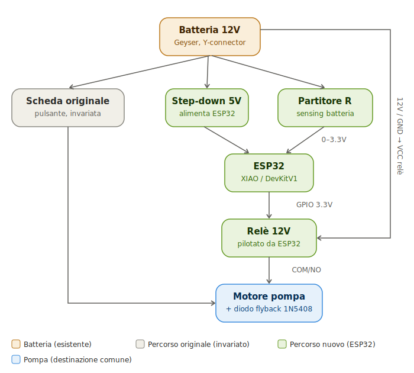
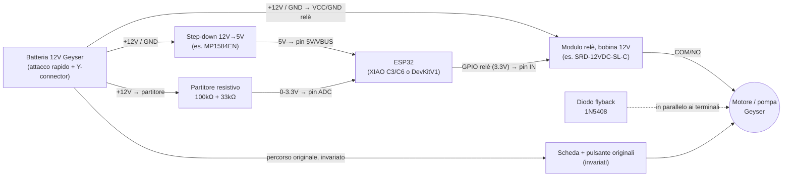

# Schema di collegamento hardware

Riferimento rapido per il cablaggio: batteria → step-down 5V → ESP32 → relè → pompa, in parallelo al percorso originale (invariato). Architettura completa e motivazioni in [01-analisi-fattibilita.md](01-analisi-fattibilita.md) §3, componenti in [03-hardware-bom.md](03-hardware-bom.md).

## Diagramma



<details>
<summary>Versione Mermaid (testuale, utile per modifiche future)</summary>



</details>

Il percorso originale (batteria → scheda → pulsante → pompa) resta fisicamente separato e non modificato: il relè si collega **direttamente ai terminali del motore**, non alla scheda originale (vedi 01-analisi-fattibilita.md per il perché di questa scelta).

## Mappa pin per scheda

| Segnale | ESP32 DevKitV1 (banco, attuale) | Seeed XIAO ESP32-C3/C6 (deployment finale) |
|---|---|---|
| GPIO relè pompa (→ pin IN del modulo relè) | GPIO26 | GPIO2 |
| GPIO buzzer (opzionale, preavviso) | GPIO27 | GPIO3 |
| ADC partitore batteria | GPIO34 (input-only) | GPIO4 |
| I2C SDA (sensore corrente pompa, INA219) | GPIO21 | GPIO6 |
| I2C SCL (sensore corrente pompa, INA219) | GPIO22 | GPIO7 |
| Alimentazione ESP32 | 5V/VIN da step-down | 5V/VBUS da step-down |

## Sensore corrente pompa (INA219, opzionale)

Modulo I2C pronto (es. INA219 breakout, shunt 0.1Ω integrato, range tipico ±3.2A/26V) — nessun partitore resistivo da costruire, a differenza dell'ADC della batteria.

```
Pompa/motore ──[terminale VIN+ del modulo]──[terminale VIN- del modulo]── resto del circuito
                (in serie: la corrente della pompa deve attraversare il modulo)

VCC modulo → 3.3V ESP32        GND modulo → GND ESP32
SDA modulo → GPIO21 (DevKit) / GPIO6 (XIAO)
SCL modulo → GPIO22 (DevKit) / GPIO7 (XIAO)
```

Usato per rilevare il serbatoio vuoto dal pattern di assorbimento della pompa (soglia configurabile da UI, vedi [06-api.md](06-api.md) — `GET/PUT /api/pump-current`): il comportamento esatto (corrente che sale o scende a vuoto) va tarato osservando le letture reali, varia da modello a modello di pompa.

Valori da [firmware/src/config.h](firmware/src/config.h) — è la fonte di verità, aggiornare questa tabella se cambiano.

## Partitore resistivo batteria

```
Batteria 12V+ ──[ R1 100kΩ ]──┬──[ R2 33kΩ ]── GND
                                │
                             pin ADC ESP32 (0–3.3V)
```

Rapporto R2/(R1+R2) ≈ 0.248 → 12.6V batteria diventa ≈3.13V sull'ADC, entro il range 0-3.3V. Valori indicativi (vedi [03-hardware-bom.md](03-hardware-bom.md)): da verificare con un multimetro reale una volta montato, i due resistori hanno tolleranze che spostano leggermente il rapporto.

## Note di sicurezza

- **Diodo flyback obbligatorio** ai capi del motore: assorbe il picco induttivo generato all'apertura del relè, protegge i contatti da usura/archi (catodo verso il polo positivo del motore).
- **Massa comune**: batteria, ESP32, relè e partitore devono condividere lo stesso GND.
- **Non collegare 12V ai pad BAT** della XIAO: quel connettore è per una LiPo 3.7V con chip di gestione carica integrato, un ingresso a 12V lo danneggia. Il 5V va sempre nel pin 5V/VBUS.
- I punti fisici esatti di aggancio sul dispositivo reale (dove derivare i fili di motore e batteria) sono ancora da individuare: vedi [05-fase0-guida-apertura.md](05-fase0-guida-apertura.md).
