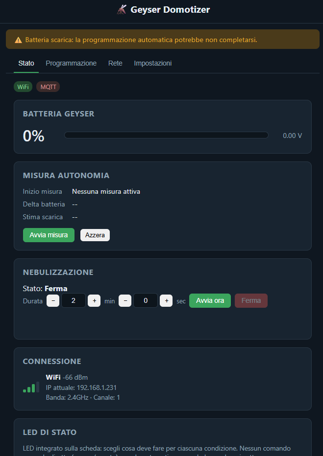
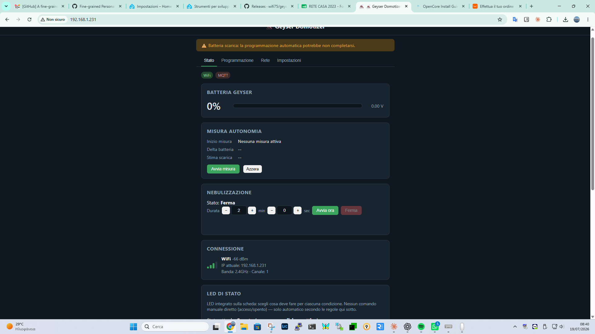
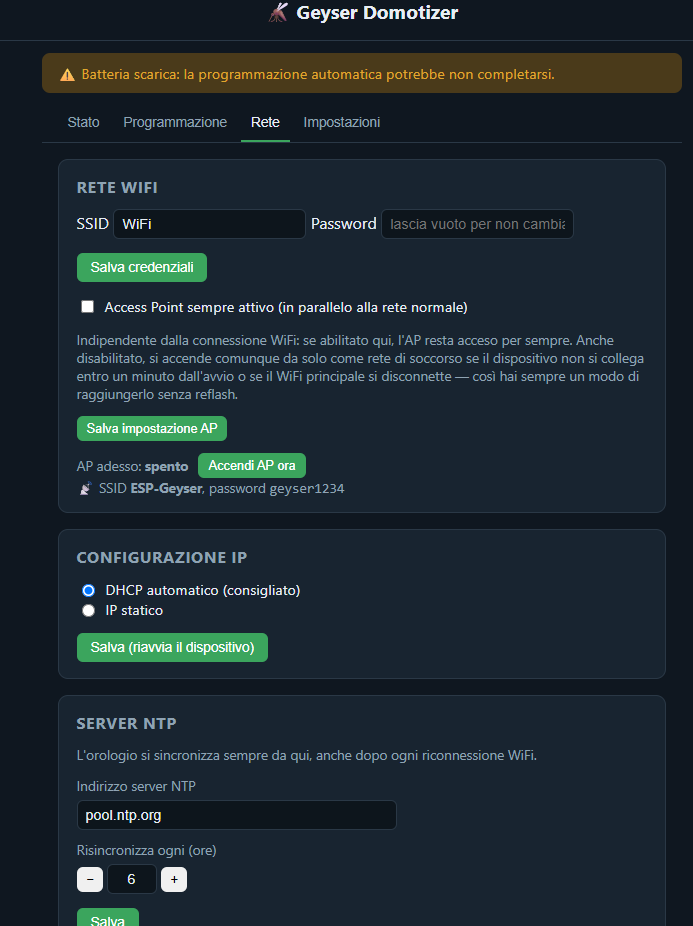
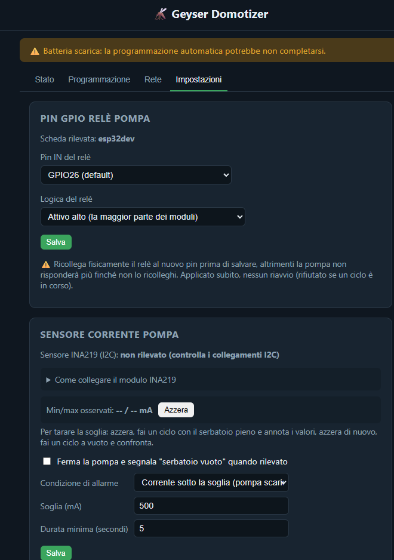

# 🦟 Geyser Domotizer

**Trasforma il tuo nebulizzatore Stocker Geyser 12L in un dispositivo intelligente con programmazione, automazione e controllo remoto da browser.**

Progetto di "domotizzazione" non invasiva dello **Stocker Geyser 12L** — aggiunge un'interfaccia web moderna e gestione remota mantenendo **100% compatibilità** con i controlli manuali originali del dispositivo. Niente modifiche permanenti, niente rischi.

### ✨ Caratteristiche principali

| | |
|---|---|
| 📱 **Interfaccia web moderna** | Dashboard responsive con 4 tab (Stato, Programmazione, Rete, Impostazioni) |
| 🔋 **Monitoraggio batteria** | Percentuale e tensione in tempo reale |
| 📅 **Programmazione settimanale** | Multipli slot giornalieri con orari/durate configurabili |
| ⏱️ **Avvio manuale remoto** | Controllo istantaneo dal browser |
| 🔄 **OTA auto-update** | Aggiornamenti da GitHub direttamente dal device |
| 🏠 **Home Assistant** | MQTT + Home Assistant Discovery nativo |
| 🔐 **mDNS** | Raggiungibile sempre come `http://geyser.local` |
| 💾 **Backup/Restore** | Export/import configurazione in un click |
| 📊 **Event log** | Storico degli ultimi 24 eventi |
| 🔒 **Auth opzionale** | HTTP Basic Auth per azioni admin (`ADMIN_PASSWORD`) |

## 🚀 Quick Start

### Opzione 1: Test senza hardware (5 minuti)

Prova l'interfaccia completa con dati simulati:

```bash
cd mock-server
python server.py   # apre http://localhost:8000
```

Perfetto per testare la UI, programmazione, configurazione senza una scheda fisica.

### Opzione 2: Deploy su ESP32 (30 minuti per il primo flash)

**Prerequisiti**: PlatformIO, scheda ESP32 (DevKit V1 / XIAO ESP32-C3 / XIAO ESP32-C6), cavo USB

1. **Clone il repo**:
   ```bash
   git clone https://github.com/wifi75/geyser-domotizer.git
   cd geyser-domotizer/firmware
   ```

2. **Configura credenziali** (opzionale per il primo flash):
   ```bash
   cp src/config.local.h.example src/config.local.h
   # Edita config.local.h con SSID/password WiFi reali
   ```

3. **Flash la scheda** (sostituisci COM3 con la tua porta):
   ```bash
   pio run -e esp32dev -t upload --upload-port COM3
   pio run -e esp32dev -t uploadfs --upload-port COM3
   ```

4. **Accedi al device**:
   - Browser: `http://geyser.local` (mDNS, dalla v0.49.0)
   - Oppure: usa `pio device monitor -p COM3 -b 115200` per trovare l'IP

---

## 📋 Stato del progetto

**Versione corrente**: [v0.51.0](https://github.com/wifi75/geyser-domotizer/releases/tag/v0.51.0) — [All Releases →](https://github.com/wifi75/geyser-domotizer/releases)

### Schede testate

| Scheda | Status | Note |
|---|---|---|
| **ESP32 DevKit V1** | ✅ Produzione | Testato end-to-end: Web UI, batteria, programmazione, MQTT, OTA. [Dettagli →](boards/esp32dev.md) |
| **XIAO ESP32-C6** | ✅ Produzione | Boot, WiFi, dashboard web verificati. Richiede fork PlatformIO community. [Dettagli →](boards/xiao-esp32c6.md) |
| **XIAO ESP32-C3** | ⚠️ Compila | Compilato ma non ancora provato su hardware fisico. [Dettagli →](boards/xiao-esp32c3.md) |

### Limitazioni note (non sono bug)

- **Deep-sleep disabilitato** — `loop()` sempre attivo per UI reattiva. WiFi modem-sleep + CPU 80MHz attivi per ridurre consumi (dato ancora da validare su hardware reale).
- **Fase 0 Geyser reale** — Non ancora effettuata. Il banco di test usa un relè standalone, non il motore originale Geyser. Vedi [05-fase0-guida-apertura.md](05-fase0-guida-apertura.md) per la procedura.
- **INA219 (sensore corrente tank-empty)** — Compilato e integrato in firmware/UI, mai calibrato su hardware reale — direzione soglia è una stima.

## 📁 Struttura del progetto

```
.
├── 01-analisi-fattibilita.md      Fattibilità tecnica, architettura, rischi
├── 02-decisioni-aperte.md          Decisioni di design e trade-off
├── 03-hardware-bom.md              Componenti hardware e costi stimati
├── 04-roadmap.md                   Roadmap e fasi di implementazione
├── 05-fase0-guida-apertura.md      Procedura hands-on per aprire il Geyser
├── 06-api.md                       ⭐ Contratto API REST (firmware ↔ mock-server)
├── 07-schema-collegamento.md       Schema cablaggio e mappa pin
│
├── boards/
│   ├── esp32dev.md                 ESP32 DevKit V1 — pinout, alimentazione
│   ├── xiao-esp32c3.md             XIAO ESP32-C3 — pinout, note
│   └── xiao-esp32c6.md             XIAO ESP32-C6 — toolchain special (pioarduino)
│
├── web/                            Interfaccia web (HTML/CSS/JS vanilla)
│   ├── index.html                  Layout (4 tab: Stato/Programmazione/Rete/Impostazioni)
│   ├── app.js                      Logica frontend (API client, UI state)
│   └── style.css                   Styling (tema scuro, responsive)
│
├── mock-server/                    Server Python per testare UI senza hardware
│   ├── server.py                   Flask app che simula l'API REST
│   └── README.md                   Istruzioni e dettagli
│
└── firmware/                        Progetto PlatformIO per ESP32
    ├── src/
    │   ├── main.cpp                Entry point, loop principale
    │   ├── config.h                Pin e parametri (customizzare qui)
    │   ├── config.local.h.example  Template per credenziali reali (gitignored)
    │   ├── webserver.cpp/h         Routing HTTP REST
    │   ├── pump.cpp/h              Controllo relè pompa
    │   ├── battery.cpp/h           ADC lettura batteria
    │   ├── schedule.cpp/h          Programmazione settimanale (NVS)
    │   ├── mqtt_client.cpp/h       MQTT client + Home Assistant Discovery
    │   ├── network_settings.cpp/h  Config WiFi/IP (con rollback)
    │   ├── ota.cpp/h               OTA updates da GitHub
    │   ├── led_control.cpp/h       Controllo LED (per-condition modes)
    │   ├── event_log.cpp/h         Ring buffer 24 eventi recenti
    │   ├── config_backup.cpp/h     Export/import configurazione NVS
    │   └── ...                     [Auth, GPIO settings, NTP, etc.]
    │
    ├── tools/
    │   └── sync_web_assets.py      (PlatformIO pre-step) copia web/ → data/
    │
    ├── data/                       LittleFS image assets (generato, gitignored)
    ├── platformio.ini              Configurazione build (3 environments)
    └── README.md                   Build & flash commands
```

**⭐ Punto di partenza consigliato**: leggi [06-api.md](06-api.md) per capire il contratto REST che both firmware e mock-server implementano identicamente.

## 🔧 Flashing completo (prima volta su una scheda vergine)

Una scheda ESP32 nuova **non ha** bootloader/partizioni/app: tutti e 3 si generano contemporaneamente con il primo `pio run -t upload`.

### Step-by-step

1. **Installa dipendenze**:
   ```bash
   pip install platformio
   ```

2. **Collega la scheda via USB** e identifica la porta:
   - Windows: `COM3`, `COM4`, ... (vedi Device Manager)
   - Linux/Mac: `/dev/ttyUSB0`, `/dev/ttyACM0`, `/dev/cu.usbserial-*`

3. **Clone e configura**:
   ```bash
   git clone https://github.com/wifi75/geyser-domotizer.git
   cd firmware
   
   # Copia il template e riempi con le tue credenziali WiFi:
   cp src/config.local.h.example src/config.local.h
   # Edita src/config.local.h → WIFI_SSID, WIFI_PASSWORD, MQTT credenziali, etc.
   ```

4. **Compila e flasha firmware** (scegli la TUA scheda):

   **📌 Per ESP32 DevKit V1**:
   ```bash
   pio run -e esp32dev -t upload --upload-port COM3
   pio run -e esp32dev -t uploadfs --upload-port COM3
   ```

   **📌 Per XIAO ESP32-C3**:
   ```bash
   pio run -e xiao-esp32c3 -t upload --upload-port COM3
   pio run -e xiao-esp32c3 -t uploadfs --upload-port COM3
   ```

   **📌 Per XIAO ESP32-C6** (richiede fork `pioarduino`):
   ```bash
   pio run -e xiao-esp32c6 -t upload --upload-port COM3
   pio run -e xiao-esp32c6 -t uploadfs --upload-port COM3
   ```
   ⚠️ Vedi [boards/xiao-esp32c6.md](boards/xiao-esp32c6.md) per note sul toolchain.

   (Sostituisci `COM3` con la tua porta seriale: `COM4`, `/dev/ttyUSB0`, `/dev/ttyACM0`, ecc.)

6. **Verifica il boot**:
   ```bash
   pio device monitor -p COM3 -b 115200
   ```
   Dovresti vedere nel seriale:
   ```
   WiFi connesso, IP: 192.168.1.231
   ```

7. **Accedi al device**:
   - Browser: `http://geyser.local` oppure `http://192.168.1.231`
   - La password AP di default (se non connesso a WiFi) è `geyser1234`

---

## 🌐 Aggiornamenti OTA (dopo il primo flash)

Una volta che il device è online, gli aggiornamenti **non necessitano più USB** né PlatformIO.

### Opzione A: OTA automatico da GitHub
1. Apri la dashboard → tab **Stato**
2. Pulsante **"Controlla su GitHub"** — verifica la versione più recente
3. Pulsante **"Aggiorna ora"** — scarica e flasha firmware + sito
4. Device si riavvia autonomamente

### Opzione B: Upload manuale
1. Scarica i file `.bin` dall'ultima [Release](https://github.com/wifi75/geyser-domotizer/releases/latest)
   - `firmware-esp32dev.bin` (o `-xiao-esp32c3.bin` / `-xiao-esp32c6.bin`)
   - `littlefs-esp32dev.bin` (o per il tuo board)
2. Dashboard → tab **Impostazioni** → **Aggiornamento manuale**
3. Carica **prima** il firmware, **poi** (dopo il riavvio) il sito

---

## 🏠 Integrazione Home Assistant / MQTT

Il firmware pubblica automaticamente entità MQTT con Home Assistant Discovery, visibili in HA senza configurazione manuale.

### Setup MQTT nel device:
1. Dashboard → tab **Impostazioni**
2. Sezione **MQTT**: broker IP, user/password
3. Salva → il device si riconnette e pubblica le entità

### Entità pubblicate (automatiche in HA):
- `geyser_domotizer/battery/%` — percentuale batteria
- `geyser_domotizer/battery/v` — tensione batteria
- `geyser_domotizer/pump/active` — stato pompa
- `geyser_domotizer/pump/remaining_secs` — tempo rimasto ciclo
- `geyser_domotizer/online` — device online/offline
- `geyser_domotizer/schedule/count` — numero slot programmati
- `geyser_domotizer/command/start` — comando avvia pompa
- `geyser_domotizer/command/stop` — comando ferma pompa

Consulta [06-api.md § MQTT](06-api.md#mqtt) per la lista completa e i topic.

---

## 🛠️ Sviluppo locale (senza hardware)

Perfetto per testare la UI, customizzarla, o sviluppare nuove funzionalità senza una scheda fisica.

```bash
cd mock-server
python server.py
# Apri http://localhost:8000 nel browser
```

Il mock server implementa **esattamente** la stessa API REST del firmware ([06-api.md](06-api.md)), con dati simulati e realistici. Qualsiasi modifica alla UI in `web/` si riflette istantaneamente nel mock (no build step).

Vedi [mock-server/README.md](mock-server/README.md) per dettagli su variabili d'ambiente e porte.

## 📊 Dashboard Web

La dashboard è divisa in 4 tab per organizzare tutte le funzionalità:

### Tab **Stato** — Monitoraggio in tempo reale



- **Batteria Geyser**: percentuale e tensione (V) con indicatore grafico
- **Misura autonomia**: avvia una misura pratica del consumo batteria e registra il delta energetico
- **Nebulizzazione**: controllo manuale con durata in minuti e secondi
- **Connessione**: stato WiFi, SSID, segnale (dBm), banda, IP attuale
- **Aggiornamenti**: pulsante "Controlla su GitHub" per verificare nuove versioni
- **Access Point**: stato AP di emergenza (SSID, password, IP)

### Tab **Programmazione** — Agenda settimanale



- **7 giorni della settimana**, ciascuno con multipli slot di partenza
- **Per ogni slot**: orario e durata (minuti), toggle abilitazione, tasto rimuovi
- **Funzioni comode**:
  - `+ Aggiungi partenza` — aggiunge un nuovo slot a quel giorno
  - `Copia le partenze di questo giorno` — duplica la programmazione
  - `Incolla le partenze copiate` — applica rapidamente a un altro giorno
- **Gestione persistente**: tutte le modifiche sono salvate automaticamente in NVS

### Tab **Rete** — Configurazione WiFi e IP



- **Credenziali WiFi**: nome rete (SSID) e password, salvabili senza reboot
- **Access Point di emergenza**:
  - Toggle "Accendi AP ora" — attiva istantaneamente l'AP come fallback
  - SSID fisso: `ESP-Geyser`, password: `geyser1234` (configurabile in `config.h`)
  - Sempre attivo se WiFi STA non si connette entro 60s da boot (safety net)
- **Configurazione IP**:
  - Scelta tra **DHCP** (dinamico) o **Static** (manuale)
  - Se statico: IP locale, gateway, netmask, DNS — con rollback automatico se il device diventa irraggiungibile

### Tab **Impostazioni** — Configurazione avanzata



Sezioni di configurazione per operazioni più tecniche:
- **GPIO Settings**: scelta del pin relè pompa e logica (active-high/low)
- **NTP Server**: configurazione server ora (sincronizzazione oraria)
- **MQTT**: credenziali broker, topic root, Home Assistant Discovery
- **Sensore corrente**: configurazione INA219 per rilevamento tank-empty
- **LED di stato**: controllo LED per pompa/OTA/WiFi (fisso, lampeggiante, spento)
- **Backup/Restore**: export/import configurazione completa in JSON
- **Riavvia dispositivo**: pulsante per soft-restart
- **Info dispositivo**: versione firmware, spazio disponibile, diagnostiche

## 🐛 Troubleshooting

### Device non raggiungibile dopo il flash
1. **Controlla il seriale** per errori di boot:
   ```bash
   pio device monitor -p COM3 -b 115200
   ```
2. **Se vedi `nvs_open failed: NOT_FOUND` ripetuto**: la partizione NVS è corrotta
   - Fix: `esptool.py --port COM3 erase-flash` (cancella TUTTO) + reflash completo
3. **Se il WiFi non si connette**:
   - Verifica SSID/password in `config.local.h` prima di compilare
   - Oppure usa l'AP di emergenza (default `ESP-Geyser` / `geyser1234`)

### OTA fallito con "Could Not Activate The Firmware"
- Scarica e flasha manualmente i `.bin` tramite la UI (Upload manuale)
- Non è un bug del firmware, è un race condition rarissimo (già fixato in v0.50.2+)

### mDNS non funziona / `geyser.local` non si risolve
- Alcune reti enterprise bloccano mDNS
- Alternativa: usa l'IP diretto trovato dal seriale o dal router

---

## 🏗️ Architettura

**Frontend + Backend separati, stesso API contract:**
- **Frontend** (`web/`): HTML/CSS/JS vanilla, zero build step, funziona identicamente su mock-server e firmware
- **Backend firmware** (`firmware/src/webserver.cpp`): AsyncWebServer con routing REST
- **Backend mock** (`mock-server/server.py`): Flask che simula l'API
- **API contract** ([06-api.md](06-api.md)): **single source of truth** per ambo i backend

**Persistenza dati:**
- **Impostazioni** (WiFi, MQTT, GPIO, schedule, etc.): NVS (Non-Volatile Storage), surviva agli OTA
- **Assets web** (HTML/CSS/JS): LittleFS partition, updatable separatamente
- **Event log**: RAM ring buffer 24 entries, pulito al reboot
- **Credenziali**: `config.local.h` (gitignored), mai committa segreti

**Aggiornamenti sicuri:**
- **OTA firmware**: `HTTPUpdate` library ESP32, protetto da hash + TLS
- **OTA LittleFS**: `httpUpdate.updateSpiffs()` con partition type check
- **Parallelizzato**: OTA in un task FreeRTOS separato, UI reattiva durante download

---

## 💬 Supporto & Contributi

- **Segnala bug**: [GitHub Issues](https://github.com/wifi75/geyser-domotizer/issues)
- **Suggerisci feature**: apri una [Discussion](https://github.com/wifi75/geyser-domotizer/discussions) o Issue etichettata `feature-request`
- **PRs welcome**: forks + pull request con descrizione del change

### Per contribuire al firmware:
1. Leggi [CLAUDE.md](CLAUDE.md) — guida architetturale per Claude Code
2. Crea branch da `master`
3. Verifica che compili per tutti e 3 gli environment: `pio run -e esp32dev`, `pio run -e xiao-esp32c3`, `pio run -e xiao-esp32c6`
4. Submitt PR — CI verifica la build

---

## 📜 Licenza

[MIT License](LICENSE) — libero di usare, modificare, distribuire

---

## 📖 Documentazione & Riferimenti

### Progetto
- **[CLAUDE.md](CLAUDE.md)** — Guida architetturale per sviluppatori (decision records, convenzioni)
- **[CHANGELOG.md](CHANGELOG.md)** — Storico versioni e cambiamenti
- **[06-api.md](06-api.md)** — **Contratto API REST completo** (read first!)

### Hardware
- **[Stocker Geyser 12L](https://www.agrieuro.com/stocker-geyser-12l-nebulizzatore-antizanzare-da-giardino-batteria-12-litri-12v-25ah-p-62880.html)** — Il dispositivo target
- **[Manuale Stocker ufficiale (PDF)](https://www.stockergarden.com/wp-content/uploads/2023/01/MKT_410-411_A5_Manual_Revisione-02_lowres-1-8.pdf)** — Dettagli meccanici e schema originale
- **[Analisi fattibilità](01-analisi-fattibilita.md)** — Ricerca su come integrarsi senza modifiche permanenti

### Schede supportate
- **[ESP32 DevKit V1](boards/esp32dev.md)** — Bench test (produzione), pinout, board.txt customizzato
- **[XIAO ESP32-C3](boards/xiao-esp32c3.md)** — Reference design per battery deployment (compila, not yet tested)
- **[XIAO ESP32-C6](boards/xiao-esp32c6.md)** — Reference design per battery deployment (tested, richiede pioarduino fork)

### Tecnologie usate
| Componente | Docs |
|---|---|
| **PlatformIO** | https://docs.platformio.org/ |
| **AsyncWebServer** | https://github.com/mathieucarbou/ESP32Async |
| **ArduinoJSON** | https://arduinojson.org/ |
| **MQTT** | [Home Assistant Discovery](https://www.home-assistant.io/integrations/mqtt/#discovery) |
| **ESPAsyncTCP** | https://github.com/mathieucarbou/AsyncTCP (leak-fixed fork) |

---

## 👤 Autore

Progetto di **[Tiziano](mailto:tizianowifi@gmail.com)** — hobby project per Smart Home Italy.

Contributi e feedback sempre benvenuti! 🙌
