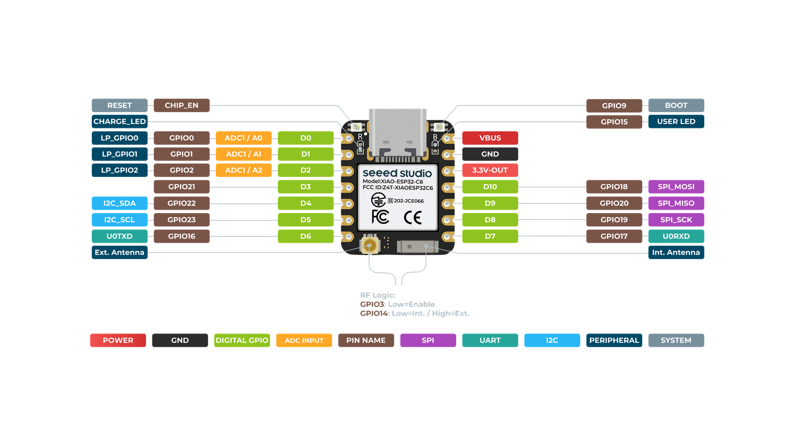
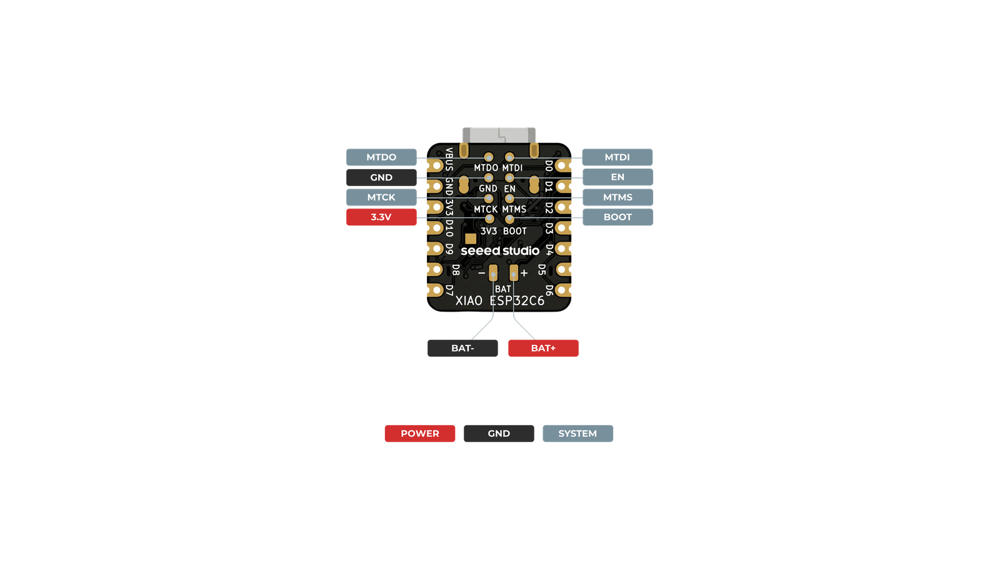

# Scheda: Seeed Studio XIAO ESP32-C6

✅ **Testato su hardware reale** (bench test, USB-powered): boot, connessione WiFi, dashboard web e API (`/api/status`, pagina principale) verificati funzionanti. Non ancora provati su questa scheda: pompa/relè, batteria reale, sensore corrente (INA219) — bench setup senza il dispositivo Geyser vero, vedi [../04-roadmap.md](../04-roadmap.md).

## Nota importante su toolchain e compilazione

Il platform ufficiale `espressif32` sul registry PlatformIO **non è più mantenuto da Espressif dal 2024**: il board manifest di `seeed_xiao_esp32c6` dichiara di supportare solo il framework `espidf`, non `arduino`, anche se il core Arduino 3.x installato lo supporterebbe benissimo (bug di manifest, non limite reale del chip). Per questo l'ambiente PlatformIO `xiao-esp32c6` in `platformio.ini` punta al fork mantenuto dalla community **[pioarduino](https://github.com/pioarduino/platform-espressif32)** invece che al registry ufficiale:

```ini
platform = https://github.com/pioarduino/platform-espressif32.git
```

Usa anche una tabella partizioni condivisa (`partitions_4MB.csv`, vedi `firmware/`) con slot app più ampi (1.5MB) rispetto allo schema di default (1.31MB): le versioni recenti del core Arduino 3.x, soprattutto con le librerie Wi-Fi 6/Thread/Zigbee della C6, superano il limite di default.

Se in futuro PlatformIO/Espressif ripristinano il supporto ufficiale, l'ambiente può tornare a `platform = espressif32` — verificare prima che il board manifest dichiari `"arduino"` tra i framework supportati (`cat ~/.platformio/platforms/espressif32/boards/seeed_xiao_esp32c6.json`).

## Pinout





Diagrammi ufficiali Seeed Studio ([wiki.seeedstudio.com/xiao_esp32c6_getting_started](https://wiki.seeedstudio.com/xiao_esp32c6_getting_started/), CC BY-SA 4.0), ridimensionati per la documentazione — mostrano il mapping serigrafia D-number ↔ pin fisico. Per la tabella GPIO effettivamente usata da questo progetto vedi sotto.

⚠️ **Non identico alla XIAO ESP32-C3**: il mapping D-number → GPIO reale di questa scheda è completamente diverso (D0=GPIO0, D1=GPIO1, D2=GPIO2, D3=GPIO21, D4=GPIO22, D5=GPIO23, D6=GPIO16, D7=GPIO17... vedi `pins_arduino.h` del core Arduino). Non è un problema per il firmware, che usa numeri di GPIO diretti (`PIN_RELAY_PUMP`, ecc.) non le sigle D-number — ma **non fare l'assunzione "stessa sigla D = stesso GPIO" passando da una scheda all'altra** quando colleghi i fili.

`config.h` ha un branch pin dedicato per questa scheda (`BOARD_XIAO_ESP32C6`), diverso da quello della C3, per un motivo importante:

⚠️ **GPIO3 e GPIO14 sono riservati all'antenna WiFi.** Il file `variant.cpp` di Seeed per questa scheda esegue `initVariant()` **prima di `setup()`** e pilota attivamente:
- GPIO3 (`WIFI_ENABLE`) → tenuto LOW per abilitare l'antenna
- GPIO14 (`WIFI_ANT_CONFIG`) → LOW per usare l'antenna integrata (HIGH = antenna esterna via u.FL)

Un buzzer o altro componente collegato a GPIO3 e portato HIGH disabiliterebbe l'antenna WiFi. Per questo `PIN_BUZZER` su questa scheda è GPIO1, non GPIO3 come sulla C3.

| GPIO | Uso in questo progetto |
|---|---|
| GPIO2 | `PIN_RELAY_PUMP` (relè pompa, default) |
| GPIO1 | `PIN_BUZZER` (preavviso acustico, opzionale) |
| GPIO4 | `PIN_BATTERY_ADC` |
| GPIO6 | `PIN_I2C_SDA` (sensore INA219) |
| GPIO7 | `PIN_I2C_SCL` (sensore INA219) |
| GPIO15 | `PIN_STATUS_LED` (`LED_BUILTIN`, controllabile da UI tab Stato) |
| GPIO3, GPIO14 | ⚠️ riservati all'antenna WiFi, non usare |

## LED di stato

GPIO15 è il `LED_BUILTIN` di questa scheda: puramente automatico (nessun comando manuale, era stato provato ma restava "sempre acceso" una volta premuto, causa di confusione — vedi CHANGELOG v0.36.0). Fisso acceso durante una nebulizzazione, lampeggiante durante un aggiornamento OTA o quando il WiFi è disconnesso, spento altrimenti. Visibile in tab Stato → card "LED di stato", esposto via `GET/PUT /api/led`. La logica attivo-alto/basso è un default (attivo basso), correggibile via `PUT /api/led` (`{"activeLow": false}`) se il verso risultasse invertito su un esemplare specifico.

## Troubleshooting: relè che non si eccita

Se il relè non scatta sul pin di default (D2/GPIO2) ma il modulo relè è verificato funzionante (testato con successo su un'altra scheda, alimentazione e logica attivo-alto/basso corrette, e la UI conferma "Attiva" quando avvii la pompa), prova un pin diverso dal menu "Pin GPIO relè pompa" (Impostazioni) — es. **D3/GPIO21**, applicato subito senza riavvio. Riscontrato almeno un esemplare con GPIO2 apparentemente non funzionante isolatamente (probabile difetto di saldatura del singolo pin), risolto passando a GPIO21.

## Troubleshooting: AP non raggiungibile / non assegna IP via DHCP

Riscontrato su un esemplare (dopo diversi cicli di flash/test): al boot il log seriale mostrava ripetutamente `[E][Preferences.cpp:47] begin(): nvs_open failed: NOT_FOUND` per tutti i moduli (`WifiSettings`, `GpioSettings`, ecc.), e l'Access Point risultava visibile via scan ma non assegnava indirizzi IP ai client che tentavano di connettersi — sintomo di una partizione NVS corrotta (non un bug del codice AP/DHCP). Risolto con un erase completo della flash e reflash da zero:

```
python -m esptool --port COMx erase-flash
pio run -e xiao-esp32c6 -t upload --upload-port COMx
pio run -e xiao-esp32c6 -t uploadfs --upload-port COMx
```

Dopo il reflash gli errori NVS sparivano dal log di boot e l'AP (`ESP-Geyser`, password `geyser1234` di default — vedi `AP_PASSWORD` in `config.h`/`config.local.h`) tornava raggiungibile e assegnava correttamente gli IP via DHCP. Se ti ritrovi in questa situazione, verifica prima il log seriale (`pio device monitor -p COMx -b 115200`) per lo stesso errore `nvs_open failed` prima di sospettare un problema hardware o di rete.

## Troubleshooting: relè che clicca ad ogni riavvio/reflash (attenuato da v0.40.0, rinforzato da v0.41.0)

Prima della v0.40.0, `Pump::begin()`/`Pump::reconfigure()` chiamavano `pinMode(relayPin, OUTPUT)` **prima** di `digitalWrite(relayPin, offLevel)`: su ESP32 il pin, appena passato a OUTPUT, parte per un istante a LOW prima che `digitalWrite` lo porti allo stato di riposo corretto — su un relè active-low (il default) questo transiente lo eccitava brevemente ad ogni singolo boot o reflash, anche senza alcun ciclo pompa reale (il registro eventi `/api/events` non mostrava nessun evento `pump` corrispondente).

La v0.40.0 ha invertito l'ordine (`digitalWrite` prima di `pinMode(OUTPUT)`), ma il click può ancora presentarsi: `pinMode(OUTPUT)` su ESP32 disabilita brevemente l'uscita durante la riconfigurazione IOMUX del pin, lasciandolo per un istante flottante prima di riattivarla — se il pull-up/down del modulo relè non è abbastanza forte, quell'istante flottante può ancora essere letto come "attivo". La v0.41.0 aggiunge un passaggio intermedio: il pin viene messo in `INPUT_PULLUP`/`INPUT_PULLDOWN` (pull interno dell'ESP32, coerente con la logica attivo-alto/basso) *prima* di `digitalWrite`+`pinMode(OUTPUT)`, così resta al livello di riposo fin dal primo istante in cui gira il nostro codice.

⚠️ **Limite intrinseco**: nessun fix software può coprire il tempo *prima* di `setup()` — bootloader ROM + avvio del core Arduino. Se il click persiste anche con firmware ≥ v0.41.0, l'unica soluzione definitiva è una resistenza di pull **hardware** sulla linea di controllo del relè (esterna alla scheda: ~10kΩ verso 3.3V per relè active-low, verso GND per active-high) — garantisce lo stato di riposo indipendentemente da cosa fa il software durante il boot.

## Alimentazione

- **Pin 5V/VBUS**: alimentazione da USB-C o da un convertitore step-down esterno (12V→5V) per il deployment a batteria.
- **Pad BAT**: ⚠️ riservati a una LiPo 3.7V con chip di gestione carica integrato — **non collegare qui i 12V** (vedi [../07-schema-collegamento.md](../07-schema-collegamento.md)).

## Comandi PlatformIO specifici

```
pio run -e xiao-esp32c6
pio run -e xiao-esp32c6 -t upload --upload-port COMx
pio run -e xiao-esp32c6 -t uploadfs --upload-port COMx
```

Su Windows/PowerShell, se il flash o l'upload falliscono con `UnicodeEncodeError` legato alla progress bar, impostare `$env:PYTHONIOENCODING = "utf-8"` prima del comando.
